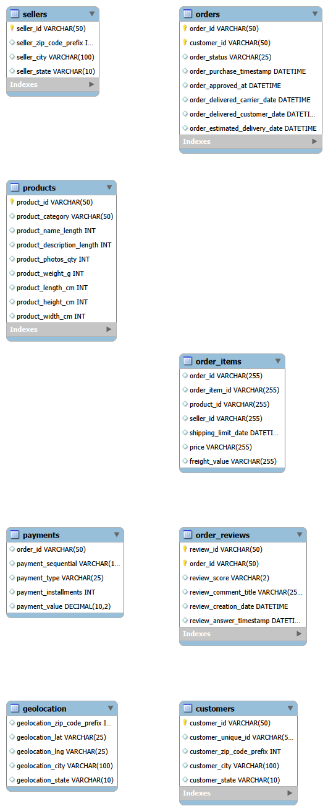
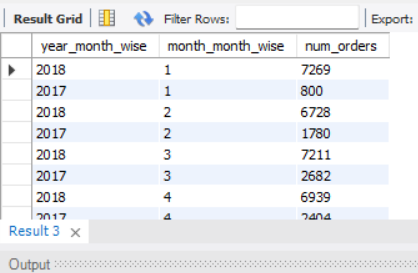
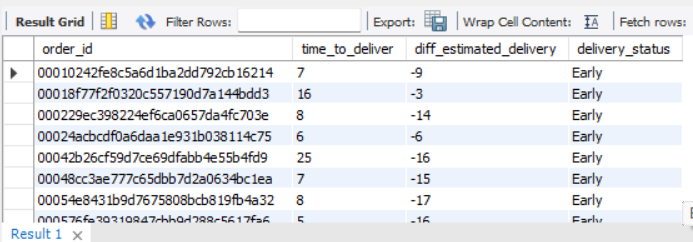
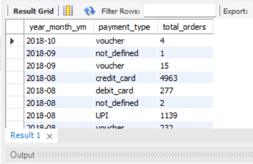

# Target E-commerce Data Analysis (MySQL)

## Project Overview
This project analyzes Target Brazil's  e-commerce dataset using MySQL.
The goal is to extract business insights related to customer behavior, order trends, delivery performance, and payment patterns.

## Tools Used
- MySQL
- SQL (CTEs, Window Functions, Joins, Aggregations)
- CSV data ingestion using LOAD DATA INFILE

## Dataset
Public Brazilian E-commerce dataset containing 100k+ orders across multiple dimensions:
- Customers
- Orders
- Order Items
- Payments
- Products
- Sellers
- Reviews
- Geolocation

## Database Schema

## Key Analysis Performed

### 1. Exploratory Data Analysis
- Data types and structure validation
- Order time range analysis
- Active cities and states

### 2. Order Trends
- Year-over-year and month-over-month order growth
- Seasonality analysis
- Time-of-day purchase behavior

### 3. Regional Insights
- State-wise order volume
- Customer distribution across states

### 4. Economic Impact
- Revenue growth (2017 vs 2018)
- Average order value by state
- Freight cost analysis

### 5. Delivery Performance
- Actual vs estimated delivery time
- Early / On-time / Late deliveries
- Fastest and slowest states

### 6. Payment Behavior
- Payment type trends over time
- Installment-based order analysis

## Sample Analysis Outputs
### Monthly Order Trends

### Delivery Performance

### Payment Trends

## Key SQL Concepts Demonstrated
- Complex Joins
- CTEs & Window Functions (DENSE_RANK, LAG)
- Date & Time transformation
- Data cleaning during ingestion
- Business-oriented aggregations

## Key Business Insights
- Orders show strong seasonality, peaking during mid-year months.
- Afternoon and night time slots account for the highest order volumes.
- Southern states show faster delivery times compared to the national average.
- Credit card remains the dominant payment method, with high installment usage.
- Freight cost significantly varies by state, impacting overall order value.

## Outcome
The analysis highlights regional growth trends, delivery efficiency gaps, and customer payment preferences, helping improve logistics planning and customer experience.

  
  

